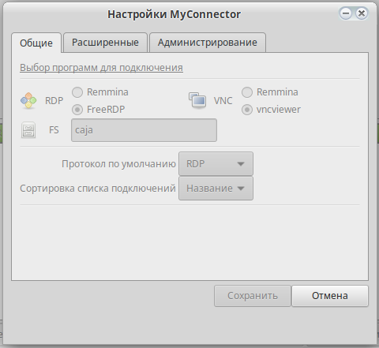
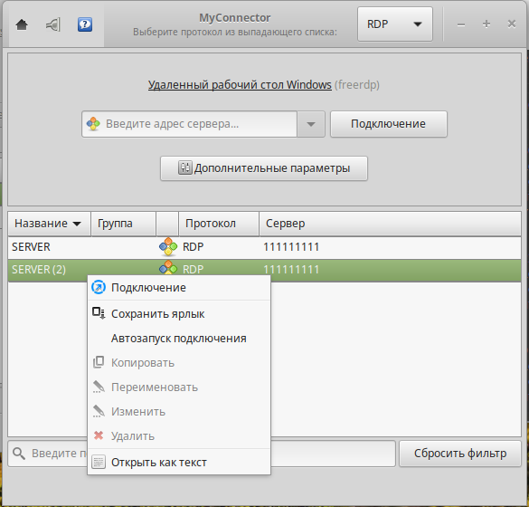

.. MyConnector
.. Copyright (C) 2014-2023 Evgeniy Korneechev <ek@myconnector.ru>

.. This program is free software; you can redistribute it and/or
.. modify it under the terms of the version 2 of the GNU General
.. Public License as published by the Free Software Foundation.

.. This program is distributed in the hope that it will be useful,
.. but WITHOUT ANY WARRANTY; without even the implied warranty of
.. MERCHANTABILITY or FITNESS FOR A PARTICULAR PURPOSE.  See the
.. GNU General Public License for more details.

.. You should have received a copy of the GNU General Public License
.. along with this program. If not, see http://www.gnu.org/licenses/.

.. _rst-admin:

Параметры администратора
========================

С версии приложения MyConnector 2.3 добавилась новая вкладка в :ref:`rst-prog-settings` - "Администрирование":

.. figure:: _images/params3.png

Для получения доступа необходимо, чтобы программа MyConnector была запущена с правами администратора:

::

    $ su -
    # myconnector
    или
    $ sudo myconnector

Использовать системные настройки
~~~~~~~~~~~~~~~~~~~~~~~~~~~~~~~~

Все настройки программы запишутся в файл ``/etc/myconnector/myconnector.conf`` (именно директория ``/etc/myconnector`` является рабочей для пользователя с правами администратора, все настройки и подключения созданные под ним сохраняются здесь) и у всех пользователей на компьютере будут именно они, без возможности внесения изменений:

Использовать системные подключения
~~~~~~~~~~~~~~~~~~~~~~~~~~~~~~~~~~

У всех пользователей будут только те подключения, которые имеются в директории ``/etc/myconnector``, без возможности внесения в них изменений:

Режим "Stealth"
~~~~~~~~~~~~~~~

Данный режим включает в себя:

* использование системных настроек и подключений (см. выше), опции обязательны для совместного использования с данным режимом;
* отключение отображения подробностей о подключении в главном окне программы (скриншот см. ниже) и в трее;
* отключение ведения журнала работы программы.

.. figure:: _images/stealth.png
