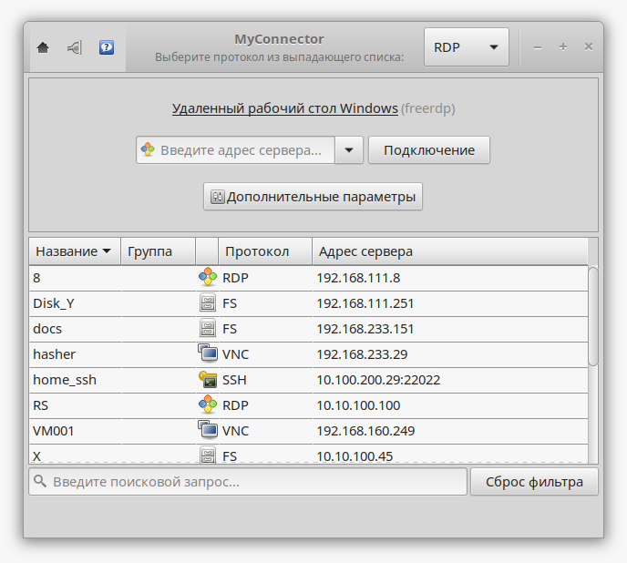

.. MyConnector
.. Copyright (C) 2014-2025 Evgeniy Korneechev <ek@myconnector.ru>

.. This program is free software; you can redistribute it and/or
.. modify it under the terms of the version 2 of the GNU General
.. Public License as published by the Free Software Foundation.

.. This program is distributed in the hope that it will be useful,
.. but WITHOUT ANY WARRANTY; without even the implied warranty of
.. MERCHANTABILITY or FITNESS FOR A PARTICULAR PURPOSE.  See the
.. GNU General Public License for more details.

.. You should have received a copy of the GNU General Public License
.. along with this program. If not, see http://www.gnu.org/licenses/.

.. _rst-first:

Первый запуск
=============

После установки программы MyConnector Вы можете его найти в главном меню, в категории "Интернет"/"Сеть". Либо запустить из командной строки::

    $ myconnector

После запуска перед Вами откроется главное окно приложения:

Сверху справа Вы можете увидеть выпадающий список с названиями технологий (протоколов) подключения. При выборе того или иного элемента внешний вид приложения изменится, будет написано как будет происходить подключение к указанному Вами адресу сервера.

Имеется поле ввода адреса и кнопка для быстрого подключения с параметрами по умолчанию. После ввода адреса и после нажатия данной кнопки (или клавиши Enter) произойдет запуск той или иной программы для подключения к указанному серверу по выбранному протоколу.

Также имеется кнопка "Дополнительные параметры" для указания параметров подключения отличных от параметров по умолчанию, таких как имя пользователя, домен, пароль и т.п. Подробнее об этом в разделе :ref:`rst-conn-settings`.

Ниже в располагается область с :ref:`rst-list`.
