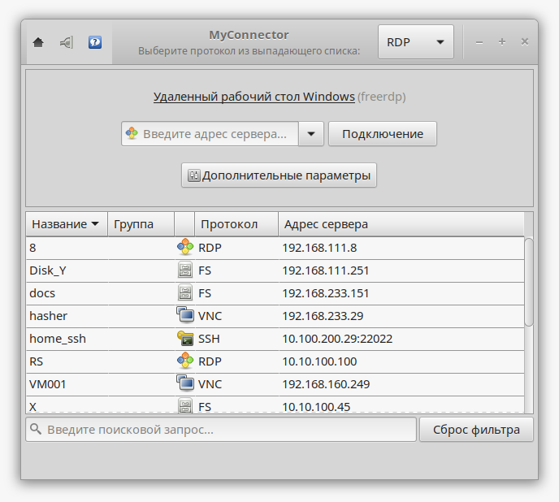

.. MyConnector
.. Copyright (C) 2014-2022 Evgeniy Korneechev <ek@myconnector.ru>

.. This program is free software; you can redistribute it and/or
.. modify it under the terms of the version 2 of the GNU General
.. Public License as published by the Free Software Foundation.

.. This program is distributed in the hope that it will be useful,
.. but WITHOUT ANY WARRANTY; without even the implied warranty of
.. MERCHANTABILITY or FITNESS FOR A PARTICULAR PURPOSE.  See the
.. GNU General Public License for more details.

.. You should have received a copy of the GNU General Public License
.. along with this program. If not, see http://www.gnu.org/licenses/.

Программа удаленного доступа MyConnector
========================================

В руководстве описаны функциональные характеристики программы и описание ее возможностей. MyConnector является новой версией (2.x) программы `Connector <https://github.com/ekorneechev/connector>`_ - :ref:`rst-diff`.

http://myconnector.ru/

.. toctree::
   :maxdepth: 1

   about
   install
   first
   prog_settings
   conn_settings
   list
   kiosk
   fs
   tray
   cli
   other
   diff
