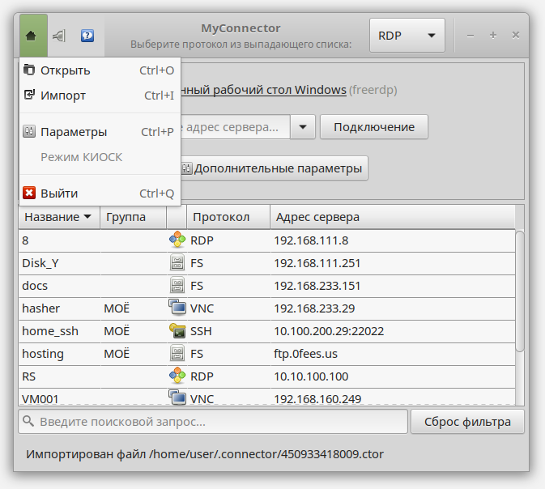
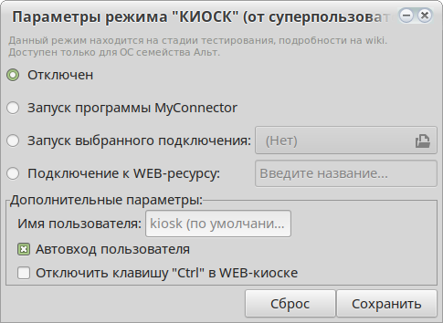

.. MyConnector
.. Copyright (C) 2014-2022 Evgeniy Korneechev <ek@myconnector.ru>

.. This program is free software; you can redistribute it and/or
.. modify it under the terms of the version 2 of the GNU General
.. Public License as published by the Free Software Foundation.

.. This program is distributed in the hope that it will be useful,
.. but WITHOUT ANY WARRANTY; without even the implied warranty of
.. MERCHANTABILITY or FITNESS FOR A PARTICULAR PURPOSE.  See the
.. GNU General Public License for more details.

.. You should have received a copy of the GNU General Public License
.. along with this program. If not, see http://www.gnu.org/licenses/.

.. _rst-kiosk:

Режим КИОСК
===========

Данная функция находится в режиме тестирования и доступна только на семействе операционных систем Альт. За основу взята статья https://wiki.altlinux.org/kiosk.

Доступ к настройке
~~~~~~~~~~~~~~~~~~

Доступ к настройке данного режима открывается через пункт главного меню "Режим КИОСК":

Как видно на данном изображении, по умолчанию доступ к настройке отключен. Для получения доступа необходимо выполнение следующих условий:

* ОС принадлежит семейству Альт (Alt Linux);
* наличие установленного пакета ``myconnector-kiosk``;
* наличие одного из поддерживаемых дисплейных менеджеров - LightDM или SDDM;
* программа MyConnector запущена с правами администратора::

    $ su -
    # myconnector
    или
    $ sudo myconnector

При выполнении всех условий пункт меню будет активным и после нажатия на него откроется окно настройки режима КИОСК:

Также пункт меню "Режим КИОСК" может быть недоступен еще по двум причинам:

Режимы работы
~~~~~~~~~~~~~

**1. Отключен.** Можно также выключить режим киоска из командной строки (sudo или root)::

    # myconnector --kiosk disable

**2. Запуск программы MyConnector.** В окружении пользователя запускается сама программа MyConnector, с возможностью подключения к любым ресурсам.

**3. Запуск выбранного подключения.** Запускается отдельное подключение (с помощью диалога открытия необходимо указать заранее сохраненный файл поддерживаемого формата: .myc, .rdp или .remmina). Указанный файл будет скопирован в домашнюю папку пользователя.

**Подключение к WEB-ресурсу.** Так называемый WEB-киоск. Запускается браузер Chromium со следующими параметрами командной строки::

    chromium --kiosk --incognito <указанный_в_настройках_URL>

Или же (если Chromium не установлен) запускается Mozilla Firefox cо следующими::

    firefox --kiosk --private-window <указанный_в_настройках_URL>

.. note:: Ключ ``--kiosk`` появился в Firefox с версии 71, если версия будет ниже - откроется обычное приватное окно браузера.

Дополнительные параметры
~~~~~~~~~~~~~~~~~~~~~~~~

По умолчанию пользователь для режима определен как ``kiosk``. Но можно указать любого другого (как существующего, так и нет - пользователь будет создан автоматически (пароль для которого, если необходимо, указывается самостоятельно) во время сохранения параметров).

Также имеется возможность настройки автовхода в систему для указанного пользователя.

Так как ни один из используемых браузеров для режима WEB-киоск не имеет возможность отключения сочетаний горячих клавиш в режиме киоска, в ``myconnector-kiosk`` есть возможность отключить клавишу :guilabel:`&Ctrl`, чтобы исключить создание новых окон и вкладок, просмотр истории и прочих возможностей по сочетаниям клавиш c :guilabel:`&Ctrl`. Для администраторов же оставлена возможность ее использования - ее функцию выполняет клавиша :guilabel:`&CapsLock`. То есть для запуска терминала нужно использовать :guilabel:`&CapsLock` + :guilabel:`&Alt` + :guilabel:`&T`, для входа в другие TTY - :guilabel:`&CapsLock` + :guilabel:`&Alt` + :guilabel:`F[2-9]`.

Конфигурационный файл
~~~~~~~~~~~~~~~~~~~~~

Все произведенные настройки записываются в файл ``/etc/myconnector/kiosk.conf`` (используется только для отображения в окне параметров режима). Подробнее (а также о настройке через командную строку) в разделе :ref:`rst-cli`.