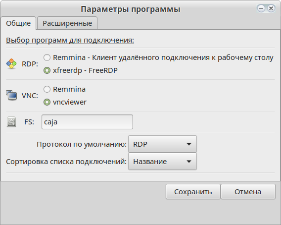
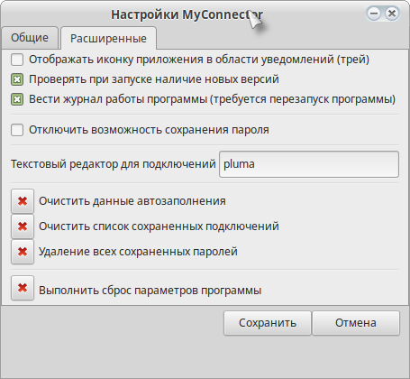

.. MyConnector
.. Copyright (C) 2014-2022 Evgeniy Korneechev <ek@myconnector.ru>

.. This program is free software; you can redistribute it and/or
.. modify it under the terms of the version 2 of the GNU General
.. Public License as published by the Free Software Foundation.

.. This program is distributed in the hope that it will be useful,
.. but WITHOUT ANY WARRANTY; without even the implied warranty of
.. MERCHANTABILITY or FITNESS FOR A PARTICULAR PURPOSE.  See the
.. GNU General Public License for more details.

.. You should have received a copy of the GNU General Public License
.. along with this program. If not, see http://www.gnu.org/licenses/.

.. _rst-prog-settings:

Параметры программы
===================

Для выбора программ, используемых по умолчанию для подключения по протоколам RDP и VNC, необходимо открыть главное меню программы и выбрать "Параметры" (или через :ref:`rst-tray`), либо нажать комбинацию клавиш :guilabel:`&Ctrl` + :guilabel:`&P`. После этого откроется окно настройки параметров приложения:

Есть возможность сменить программу для RDP-соединения - Remmina или FreeRDP. Для подключения по VNC тоже есть два варианта - Remmina и vncviewer (любая программа, предоставляющая данный функционал). По умолчанию подключение по RDP настроено через FreeRDP, VNC - через vncviewer.

Также Вы можете настроить отображение определенного протокола на главном окне приложения по умолчанию и сортировку для :ref:`rst-list`.

На вкладке "Расширенные" настраивается отображение значка в трее, проверка обновлений программы, ведение логов, редактор для файлов подключений и сохранение паролей. Есть возможность очистить базу адресов серверов, к которым было совершено подключение (выпадающий список при вводе адреса на главном окне или в доп. параметрах), :ref:`rst-list` и сохраненные пароли. Или произвести сброс всех параметров программы.

